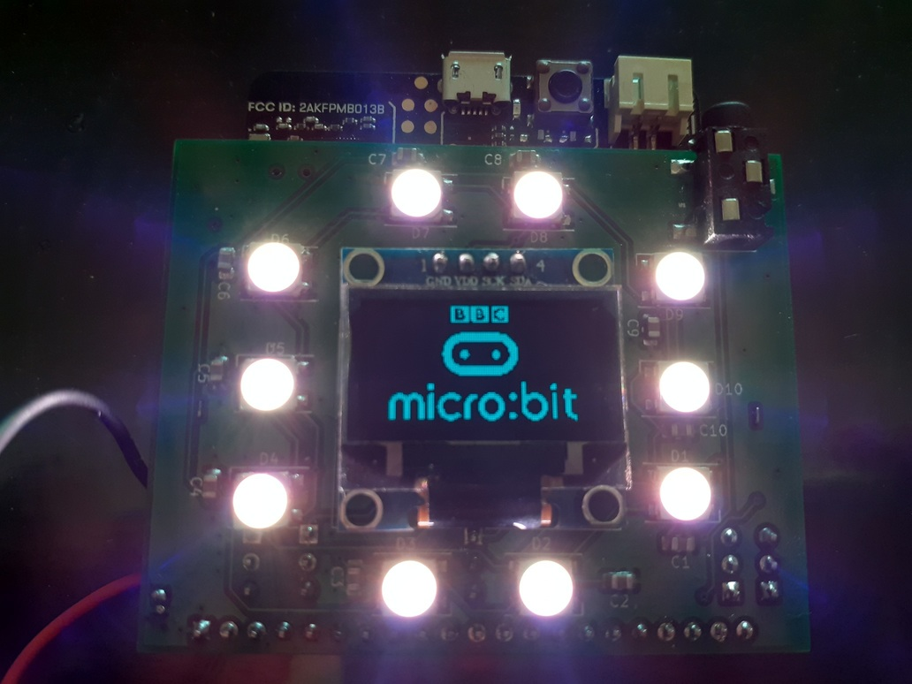

## Placa de expansión para utilizar con MICROBIT    

 

### Descripción y contexto
---

Esta placa, también llamada "shield" o "hat" en el mundo maker, permite tener acceso a todos los pines de entrada salida de la micro:bit. Además tiene incorporado un IC que permite cargar de forma autónoma una celda 18650 de ion-litio, 10 leds programables ws2812, display oled ssd1306, salida de audio, monitoreo del nivel de batería y un conector que hace muy fácil insertar la placa micro:bit.

micro:bit es una placa programable diseñada para hacer que los niños puedan aprender a programar de una forma amigable y divertida. Entre sus principales socios fundadores se encuentran; BBC, Microsoft, ARM, Lancaster University,British Council, The Institution of Engineering and Technology...(https://archive.microbit.org/es/about/)

### Guía de usuario
---
La placa está desarrollada utilizando el software Kicad, en su versión 5.1.5. Es de doble faz y permite visualizar, el display de pixels led propio de la microbit junto con un display oled ssd1306 y 10 leds ws2812 programables. Está pensada para ser alimentada por su propio conector microUSB (sin necesidad de usar el nativo de la microbit) teniendo así la posibilidad de contar con una alimentación de 3.3v y una corriente máxima de 600mA y, simultaneamente, una recarga automática de la bateria.

Todos los ejemplos disponibles en la web de microbit -makecode.microbit.org- pueden utilizarse con esta placa. Para ello se debe desconectar la micro:bit de la placa de expansión, programarla siguiendo las instrucciones detalladas en la web, luego desconectar el cable USB de la placa microbit e insertar esta en el conector de 40 pines. La forma correcta de colocar la micro:bit en la placa de expansión es la que permite visualizar en una cara el display de leds y, en la cara opuesta, el display oled ssd1306. Una vez se conecte correctamente, se puede alimentar la placa mediante el conector microUSB de la placa de expansión y deslizar la tecla de encendido a la posición de ON, o bien, si no disponemos de una fuente de alimentación USB, se puede energizar con la celda de ion-litio 18650. La conmutación entre fuentes de energía se realiza de forma automática. 
 	
### Guía de instalación
---
En este repositorio se pueden encontar todos los archivos diseñados en Kicad 5.1.5. También hay una carpeta con los gerbers ya listos para fabricación.

#### Dependencias
---
En la carpeta kicad_libraries se puede encontar la librería que diseñe para el conector de 40 pines cylconn. Allí están el footprint, el modelo 3d y el simbolo.
También utilice las siguientes librerías;

CONECTOR MICRO USB: 
                    [Footprint](https://raw.githubusercontent.com/choryuidentify/USB-Micro-B-Unknown-5s-SMT/master/images/footprint.png)

                    [3D Footprint](https://raw.githubusercontent.com/choryuidentify/USB-Micro-B-Unknown-5s-SMT/master/images/footprint_3d.png)

                    [Datasheet](https://raw.githubusercontent.com/choryuidentify/USB-Micro-B-Unknown-5s-SMT/master/datasheet.pdf)

             
DISPLAY OLED SSD1306: 
                    https://github.com/MichMich/KiCad-SSD1306_OLED-0.91-128x32.git

### Autor/es
---
Ruiz Díaz, Juan Ignacio. Ingeniero Electrónico. 
Email:ruizdiazji@gmail.com

### Información adicional
---
Para el ejemplo que se puede observar en una de las fotos, donde el display oled muestra el logo de micro:bit uitilice el código en micropython y la librería que se detalla en https://www.littlebird.com.au/a/how-to/81/0-96-oled-screen-with-micro-bit.

Si te interesa probar los distintos sensores y periféricos que tiene la placa micro:bit utilizando el lenguaje micropython, en la página https://microbit-challenges.readthedocs.io/en/latest/index.html, podes encontrar documentación muy bien detallada.

### Licencia 
---
[LICENCIA] https://github.com/ruizdiazji/microbit_hat/blob/master/LICENSE.md

Si desconoces qué tipos de licencias existen, podes visitar la página https://choosealicense.com/.

## Limitación de responsabilidades

El autor no será responsable, bajo circunstancia alguna, de daño ni indemnización, moral o patrimonial; directo o indirecto; accesorio o especial; o por vía de consecuencia, previsto o imprevisto, que pudiese surgir:

i. Bajo cualquier teoría de responsabilidad, ya sea por contrato, infracción de derechos de propiedad intelectual, negligencia o bajo cualquier otra teoría; y/o

ii. A raíz del uso de esta placa, incluyendo, pero sin limitación de potenciales defectos en el hardware o software, o la pérdida o inexactitud de los datos de cualquier tipo. Lo anterior incluye los gastos o daños asociados a fallas de comunicación y/o fallas de funcionamiento de hardware, vinculados con la utilización de esta placa
